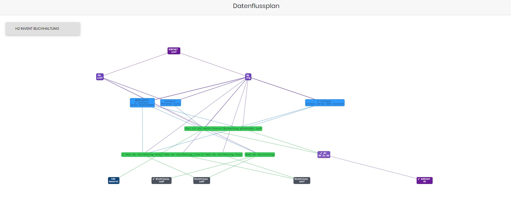
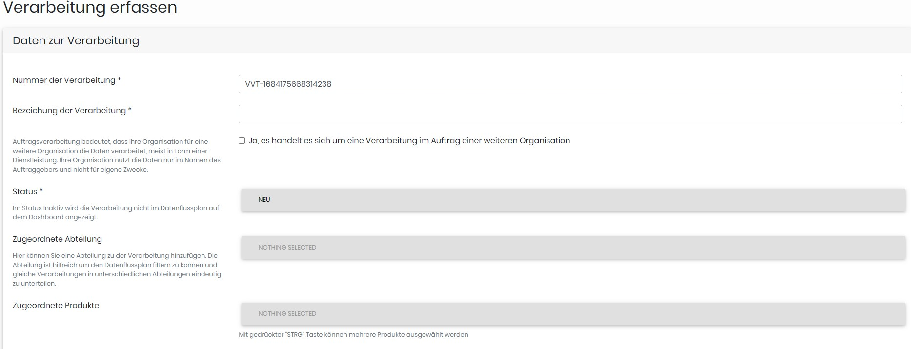
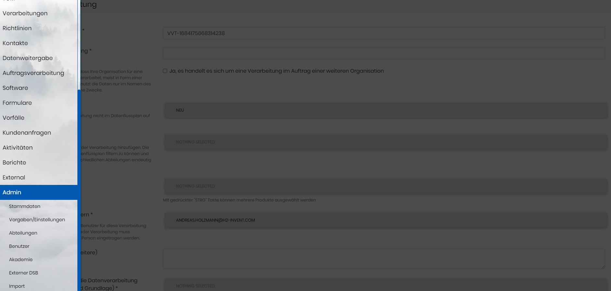

# Open-Datenschutzcenter
__Open Source Datenschutzmanagement System__

[](code_of_conduct.md)

Der Open Datenschutzcenter (ODC) ist ein Open Source Datenschutzmanagement-System für Unternehmen und Datenschutzbeauftragte. Der ODC wird kontinuierlich mit einer aktiven Community von Unternehmen, Datenschutzbeauftragten und Informationssicherheitsbeauftragten weiterentwickelt. Open Source bedeutet, dass der Quellcode der Software öffentlich zugänglich zur Verfügung steht. Unternehmen können den ODC auf einem eigenen Server betrieben, eigene Funktionen entwickeln und die Funktionalität erweitern. Die H2 Invent GmbH ist das Unternehmen hinter dem Open Datenschutzcenter und verwaltet das Repository, das Wiki und die Releases. H2 Invent entwickelt für Unternehmen neue ODC Funktionen um diesen den Anforderungen des Unternehmens anzupassen.

# Funktionen
Folgende Funktionen sind bereits im Open Datenschutzcenter integriert:
* Datenschutzakademie für interne Datenschutzschulungen zum Nachweis der kontinuierlichen Datenschutzweitergildung der Beschäftigten.
* Internes Datenschutzaudit mit einem umfangreichen Fragenkatalog, Begründungen und Hinweisen für die Umsetzung
* Abteilung einer globalen TOM aus den Audits.
* Erstellen von Technische und organisatorische Maßnahmen für Verarbeitungen.
* Erfassung von Verarbeitungen und Erstellung eines Verarbeitungsverzeichnisses mit Revisionen.
* Sortieren der Verarbeitungen nach Abteilungen und Produkten.
* Erfassung von Kontakten zu Auftragnehmern und Auftraggebern.
* Erfassung von Datenweitergaben und Auftragsverarbeitungen.
* Verlinkung von Datenweitergaben, Auftragsverarbeitungen mit Verarbeitungen und technischen und organisatorischen Maßnahmen.
* Erfassung von Datenschutzvorfällen mit Dokumentation von Folgen, Maßnahmen und Auswirkungen.
* Erstellen von IT Richtlinien mit Verlinkung zu Verarbeitungen
* Hochladen von Formularen und Verlinkung zu Produkten und Abteilungen
* Erstellung eines Netzplanes zum Anzeigen von Abhängigkeiten zwischen Verarbeitungen, Datenweitergaben und Auftragsverarbeitungen
* Erstellung von Berichten als PDF und Excel.
* Stammdaten mit Abteilungen, Schutzzielen, Produkten und Nutzerverwaltung.
* Import von Auditfragen und Verarbeitungstätigkeiten als .odif Dateien.
* To Dos und Aufgaben festhalten und zuteilen.
* Dokumentieren von Software und Konfigurationen die den Datenschutz betreffen.

### Das Dashboard
Das Dashboard stellt alle wichtigen Zahlen zum Datenschutz im Unternehmen dar. Im Kopfbereich werden alle wichtigten Zahlen und Aufgaben dargestellt. Jede Schaltfläche führt den Nutzer intuitiv zum jeweiligen Bereich oder Dokument.


### Der Datenflussplan
Alle Daten auf dem Open Datenschutzcenter werden dynamisch in dem zentralen Datenflussplan auf dem Dashboard dargestellt. Die Bereits erstellten verknüpfungen der Dokumente werden im Datenflussplan dargestellt. Damit kann der Nutzer schnell koritischten Verarbeitungen oder Datenweitergaben sehen und mögliche Verbesserungen starten.


### Formulare
Alle Dokumente können über Formulare erfasst werden. Die Datenwerden in einer strukturierten und später filterbaren Datenbank gespeichert.



### Navigation
Über die Navigation kann schnell auf jeden Bereich zugegriffen werden. Als Administrator des Mandanten stehen zusätzliche Funktionen zur Verfügung.



# Get Started
Auf Grund der Composer Abhängigkeiten wird ein Webspace für den Betrieb der Webanwendung nicht empfohlen. Enterprise bedeutet, dass ODC als Manadatenlösung und interne Webanwendung betrieben werden kann. Die Verwaltung, Updates und Wartung muss durch die Zuständige und Verantwortliche Person durchgeführt werden.

Installationsanleitung und ein Foliensatz mit Screenshots steht auf https://h2-invent.com/software/odc zur Verfügung.
* [Anleitung im Wiki](https://github.com/H2-invent/open-datenschutzcenter/wiki/Get-Started)
* [Mindestanforderungen](https://github.com/H2-invent/open-datenschutzcenter/wiki/Mindestanforderungen-an-den-Server)
# Import .odif Datei
Folgende Parameter stehen in den odif Dateien zum Import zur Verfügung und müssen auch im Dokument vorhanden sein.

* [ODIF Import Datei](https://github.com/H2-invent/open-datenschutzcenter/wiki/ODIF-Datei)

# Migrations
#### von 1.12.X auf 2.X
* nach einer umstellung des Default Teams muss eine migration der Datenbank vorgenommen werden. Für die Migration muss einmal der Command über die CLI durchgeführt werden.
Danach werden alle Audit Ziele vom Default Team 1 auf null umgestellt.
````
php bin/console app:migrate:defaultTeam
````

# Lizenz
Die aktuelle Version von Open Datenschutzcenter wird unter der AGPL-3.0 License bereitgestellt. Weitere Informationen finden Sie in der LICENSE Datei in diesem Repo.
Copyright (c) 2020 H2 invent
